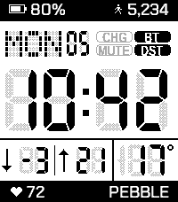
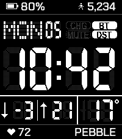
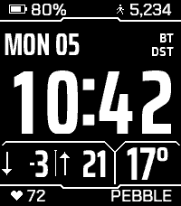

# LCD 221

A watch face for the **Pebble Time 2** that imitates the look of the Casio W-221H:
a white LCD with 7-segment digits, a dot-matrix weekday and the indicators, between a
black top bezel and bottom bezel.



Inverted colors, and a font digit style:

 

Version 1.4.0. Pebble Time 2 only (platform `emery`, 200x228 screen). Built and tested with Pebble SDK 4.33.1.

## What it shows

| Area | Content |
|---|---|
| Top bezel | A battery icon (filled to the level, with a bolt while charging) and the level, and a walking figure and the step count; or your own text instead of either (settings) |
| Weekday | Dot-matrix day name and the day of the month (`MON 05`) |
| Indicators | **BT** phone connected, **CHG** charging (it becomes **FULL** once the battery is full and the watch is still on the charger), **DST** daylight saving time is in effect in your time zone, **MUTE** Quiet Time on; as pills, only the active ones, or icons (settings). Inactive ones use the same faint gray as the unlit segments |
| Time | Large 7-segment digits. A **P** lights up for PM in 12-hour mode |
| Low / high | Today's low and high temperature side by side, each after a mark (tall arrows, triangles or LO / HI) with a divider between them |
| Right box | The current temperature (°C or °F) |
| Bottom bezel | A heart and your latest heart rate, and a text label |

Notes:

- Battery is reported by the watch in 10% steps, so it moves 100%, 90%, 80%, ...
- Steps come from Pebble Health. Heart rate is the latest reading the watch has; it shows `--` when there is none.
- Weather (the current temperature and today's high and low, for the day where your phone is) is fetched by the phone from [Open-Meteo](https://open-meteo.com) using its location, at start-up and about every 30 minutes. To save battery, the watch only asks while the phone is connected and the last reading is older than 25 minutes (or the high and low are yesterday's), and the phone app waits at least 5 minutes between fetches (25 minutes when the face is merely opened again). The temperature shows `--` if the data is more than 3 hours old, and the high and low until the first reading of the day.
- Unlit segments are drawn as a faint ghost, like a real LCD (can be switched off).
- Every part of the face can be given its own colour (see Settings).
- The Time 2's backlight is colour-capable. By default the watch face leaves it at your normal system colour, but it can tint it instead (amber like the original's LED, one of ten presets, or any of the 64 colours in the app's picker).

## Settings

Open the watch face's settings in the Pebble app. Nothing reaches the watch until you tap **Save**.
**Reset to defaults** (at the top of the page; tap it twice, so a stray tap does nothing) puts every option back to the value below (then tap Save).

A **live preview** stays at the top of the page and redraws the face with the settings as they are
now, before Save (tap it to shrink it). It runs the watch face's own drawing code, so it matches
the watch, except that the system-font text (the 7-segment indicator labels, and bezel texts with
characters the bezel font lacks) uses the phone's bold font in place of Pebble's Gothic, and the battery, steps,
heart rate and weather are sample values.

| Group | Option | Choices (default first) |
|---|---|---|
| Time & date | Time format | **Follow watch** (its 12/24-hour setting), 24-hour, 12-hour |
| | Leading zero in the hour | On (07:05), Off (`7:05`, like the original). 24-hour format only; not shown while 12-hour is selected |
| | Leading zero in 12-hour time | Off. On shows 07:05 instead of 7:05; the P beside the hours makes way, and **PM** is shown with the indicators in place of CHG / FULL (the battery icon shows a bolt while charging). Not shown while 24-hour is selected |
| | Min / max marks | **Tall arrows** (↓ beside the low, ↑ beside the high), Triangles, LO / HI. Below zero the minus goes before the number (above the triangle with Triangles) |
| Temperature | Temperature unit | **Follow watch** (Fahrenheit when the watch uses imperial units, otherwise Celsius), Celsius, Fahrenheit |
| Top bezel | Show battery level | On. When off, the left text is shown instead |
| | Left text | `30 DAY BATT` (up to 19 characters, capitals; only shown while the battery level is off) |
| | Show step count | On. When off, the right text is shown instead |
| | Right text | `WR 3ATM` (up to 19 characters, capitals; only shown while the step count is off) |
| Bottom bezel | Label | `PEBBLE` (up to 12 characters, capitals; empty for none) |
| Appearance | Case color | **Black**, Silver. Applies with custom colors too |
| | Inverted colors | Off, On (light digits on a dark LCD, like a negative-display watch; the case keeps its color) |
| | Digit style | **7-segment** (the LCD look, with unlit segments), Condensed (based on Saira), Handjet, Angular (based on Iceberg), Big Shoulders Stencil. The fonts are condensed so their digits fill the 7-segment digits' cells. A font is used for every text and number on the LCD (weekday, day, indicator labels, time, low / high and temperature), without unlit segments; the top and bottom bars keep their own text. Below zero or from 100 up, the right box leaves out the degree mark |
| | Divider lines | **Solid**, Segmented (dashes), Ruler ticks (a hairline with ticks), Corner brackets (no lines: brackets at the LCD's four corners and at the two boxes' corners beside the divider), HUD chamfer (the line splits into two 45° arms that meet the divider). The LCD window's top and bottom edges follow the same style (only Solid draws the plain LCD window edge band; Corner brackets leaves just the four corners). The bottom row is centred between the divider and the bottom of the LCD |
| | Window edge | **Match the dividers** (the edge follows the divider style, as above), Center tab (the line steps out around the middle), Notched (broken in three places, ends bent inward). The LCD window edge colour (Use custom colors) colours every edge style |
| | Indicators | **Pills** (one rounded pill each: filled when on, a faint dotted outline when off), Active only (just the labels that are on, right-aligned, two to a column), Icons (Bluetooth, a bolt for charging, a moon for Quiet Time, a sun for DST; PM in the bolt's place with the 12-hour leading zero) |
| | Show unlit segments | On, Off |
| | Backlight color | **System default** (your watch's normal colour), Amber, Warm white, Red, Orange, Yellow, Green, Cyan, Blue, Purple, Pink, **Custom color...** (shows the app's own color picker, the watch's 64 colors) |
| Custom colors | Use custom colors | Off. When on, every part of the face except the case (which keeps its **Case color**) takes the color chosen below, and **Inverted colors** is ignored. The pickers start out as the normal black-on-white theme |
| | Bezels | Top bezel left text, top bezel right text, bottom bezel heart, heart rate, label |
| | LCD panel | LCD window edge (the lines above and below the LCD, in any Window edge style), LCD background, unlit segments and labels |
| | Weekday and indicators | Weekday and day, BT, CHG / FULL, DST, MUTE |
| | Time | Hour digits, colon, minute digits, PM marker |
| | Bottom row | Low / high temperature, divider lines, temperature (including the degree mark) |
| Alerts | Vibrate on phone disconnect | Double pulse (None, Short, Long, Double, Triple, Heartbeat, SOS) |
| | Vibrate on phone reconnect | Short pulse (same patterns) |

Custom colors: the watch has 64 colors (four levels per channel), so a picked color is rounded to the nearest one. Unlit segments and dots are drawn as a sparse dither of their color (sparser on a dark LCD), so they look paler than the swatch: pick a stronger color for a stronger ghost. The fonts' anti-aliased edges are blended between each text's color and the LCD background, so they stay smooth with any combination. A digit or label with the same color as the LCD background is simply invisible.

There is no vibration during Quiet Time. When the two top-bezel texts are both long, the right
text takes the width it needs and the left one gets the rest: both drop to the smaller size if
the left one doesn't fit, and it is cut with "..." if it still doesn't.

## Building and installing

You need the Pebble command-line tool and SDK (needs Python 3.10 or newer; Python 3.13 via `uv`
is what was used, because a system Python without `ensurepip` cannot create the SDK's virtualenv):

```sh
curl -LsSf https://astral.sh/uv/install.sh | sh          # installs uv
uv tool install pebble-tool --python 3.13
pebble sdk install latest                                # tested with SDK 4.33.1
```

Build (this also installs the JavaScript dependency, `pebble-clay`):

```sh
pebble build          # produces build/<folder name>.pbw
```

The digit-style fonts in `resources/fonts/*.bin` are pre-rendered and committed; only to change
them, re-run `tools/gen_fonts.py` with the six font files it lists (needs Pillow; where to get
the fonts is in the script), then `tools/preview/build.sh`.

Run it in the emulator, and take a screenshot:

```sh
pebble install --emulator emery
pebble screenshot --emulator emery --no-open screenshot.png
```

Install on the real watch, from this computer, over Wi-Fi:

1. In the Pebble phone app, switch on **Developer Connection** and note the phone's IP address
   (also shown in the phone's Wi-Fi settings). Keep the app open. The phone and computer must
   be on the same network.
2. Run:

   ```sh
   pebble install --phone <phone-ip>
   ```

   "Connection refused" means Developer Connection is off (it switches off when the app is
   closed or the phone sleeps).

Or copy `build/*.pbw` to the phone and open it with the Pebble app. Allow the location permission
(for weather) and the health permission (for steps and heart rate) when asked.

## Releasing

`pebble build` leaves `build/<folder name>.pbw`. The SDK adds a debugging source map to it, and that
map (and some SDK helper comments in it) contains the path of the SDK on the build computer, which
includes your user name. For a copy you are going to share or publish, run:

```sh
python3 tools/strip_pbw.py --deny YourRealName --deny yourhost   # writes build/release.pbw
```

It drops the map, then scans every remaining file for home-directory paths and for any word you
`--deny`, and exits with an error if it finds one. The name the app shows as its author comes from
`author` in `package.json`; the copyright holder is in `LICENSE`.

## What the emulator can't check

The emulator has no Bluetooth link to a phone app, no coloured backlight, no real steps or heart
rate, and it cannot open the settings page. Those need the real watch: the connect/disconnect
vibrations, the backlight colours, live heart rate, and every control on the settings page.

## How it works

| File | What it is |
|---|---|
| `src/c/main.c` | The watch app: drawing, settings, services |
| `src/c/segments.h` | The seven 7-segment outlines (generated, see below) |
| `src/pkjs/index.js` | Phone side: weather fetch (Open-Meteo) and the settings page |
| `src/pkjs/config.js` | The settings page layout, defaults and choices (Clay) |
| `src/pkjs/custom-clay.js` | Runs on the settings page: hides options that don't apply, Reset button |
| `tools/gen_segments.py` | Regenerates `segments.h` from the 7-Segment font |
| `tools/gen_menu_icon.py` | Redraws the 25x25 menu icon (needs Pillow) |
| `tools/strip_pbw.py` | Makes a release copy of the built app with the debugging map removed, and checks it for identifying text |
| `resources/images/menu_icon.png` | The menu icon: the watch face's thumbnail in the Pebble app's list |
| `package.json` | App metadata, permissions, and the app-message keys |

**Drawing.** Everything on the white LCD panel is rasterized straight into the framebuffer
(`draw_lcd()` in `main.c`), which allows what the normal drawing API can't:

- The digits are polygons (the segment outlines of the font, scaled to each digit's box), with their
  bars snapped to whole pixels so every bar has the same thickness. Their edges are vertical and
  horizontal, so plain pixels are sharper than gray-fringed ones. The font digit styles are
  pre-rendered glyphs with anti-aliased edges (`resources/fonts`, `tools/gen_fonts.py`).
- Unlit segments and dots ("ghosts") are drawn with an ordered dither: a number of dots out of 16
  (`GHOST_DENSITY`, fewer in the inverted theme). Inactive indicator labels use the same colour.
- With the 7-segment digits, the indicator labels are drawn with the system font and then squashed in
  the framebuffer to 10 pixels tall, one letter at a time (the row dropped is from inside each letter,
  never from a horizontal bar, so every bar keeps the same thickness).
- The weekday is a 5x5 dot matrix, like the original.
- The bezel text is Chakra Petch, pre-rendered like the digit fonts (`resources/fonts/bezel.bin`):
  capitals 13 px tall in both bezels (22 px tall each). When a bezel's texts don't fit at that
  size, both of them drop to 11 px, then are cut with
  "...". A text with a character the font lacks (an emoji, an accented letter) uses the system
  font (Gothic) instead.
- Colours come from one place, `apply_theme()`, which fills `s_col[]` with one colour per component
  (`ColorId`: `COL_CASE`, `COL_HOURS`, `COL_BT`, ...). Without custom colours that is the normal (black on
  white) or inverted (white on black) theme, with the case black or silver. With "Use custom colors" it is
  whatever the settings page sent (`ColorSettings`, saved under its own persistent key, `COLORS_KEY`, so
  the layout of `Settings` did not change and nobody's saved settings are reset). Drawing functions take the
  colour of their component; the fonts' anti-aliasing shades are mixed from it and the LCD colour (`mix_color()`).

**Layout.** All positions are constants in the "Drawing" section of `main.c` (`LCD_*`, `BOX_*`,
`TIME_*`, `ROW3_*`, `RANGE_*`, `TEMP_*`, `BOTTOM_CAP`). There is one function per screen area
(`draw_time`, `draw_temperature_range`, `draw_temperature`, `draw_indicators`, `draw_top_bezel`, ...).

**Data flow.** The phone sends the temperature as the `Temp` message, in tenths of a degree Celsius (the watch converts it to the unit shown); the watch asks for a refresh
with `RequestWeather`. Settings from the settings page arrive as messages named after the
`messageKey`s in `config.js`, are copied into the `Settings` struct and saved with `persist_write_data`.
Ticks come once a minute. The step count is read on each minute tick, and heart rate redraws the face only when the reading changes.

## Changing things

**Look:** the layout constants above; `GHOST_DENSITY` and `GHOST_DENSITY_INVERTED` (higher =
brighter unlit segments; 8 is a checkerboard); `LABEL_H` and `LABEL_OFF_DENSITY_INVERTED`
for the indicator labels; and the colours themselves in `apply_theme()`.

**Adding a colour:** add an entry to `ColorId`, `COLOR_DEFAULTS` and `color_key()` in `main.c` (same
position in all three), the key to `messageKeys` in `package.json` (then `pebble clean`), a `colorItem(...)`
line to the "Custom colors" section of `config.js`, and use `s_col[COL_...]` where it is drawn. Each colour
costs 11 bytes in the settings message; the inbox is 1024 bytes (`app_message_open` in `init()`).

**Adding a setting** (all six steps are needed):

1. Add the item to `src/pkjs/config.js` with a `messageKey` and a `defaultValue`.
2. Add the same key to `messageKeys` in `package.json`, then run `pebble clean` (the key
   constants are generated at build time and are stale otherwise).
3. Add a field to the `Settings` struct in `main.c` (keep its groups in the order of the settings
   page), its default in `init()`, and read it in `inbox_handler()`. A full Save arrives as one app
   message: it is about 230 bytes with plain text and over 400 with emoji in the custom texts, and
   the watch's inbox is 512 bytes (`app_message_open` in `init()`), so raise that if you add much.
4. Increase `SETTINGS_KEY`. Saved settings from the old layout are then ignored (everyone's settings
   reset once), which is safer than misreading them. The same goes for `WEATHER_KEY` and `Weather`.
5. Use the value where it is drawn or acted on.
6. Run `tools/preview/build.sh` (below) so the settings page's preview knows it too.

**Live preview:** `src/pkjs/preview-data.js` is generated: `main.c` built as WebAssembly, with
`tools/preview/preview.c` standing in for the Pebble SDK, plus the digit fonts. The settings page
(`custom-clay.js`) runs it. After changing `main.c` or the fonts, rebuild it and commit the result
(CloudPebble only bundles the file):

```sh
tools/preview/build.sh     # needs: clang with the wasm32 target, wasm-ld, node
```

**Thumbnail:** the Pebble app's watchface list shows the app's menu icon (`menuIcon` in
`package.json`), including for sideloaded apps. Without one the entry has a blank thumbnail.
To change it, edit `tools/gen_menu_icon.py` and run it.

**Segment shapes:** `segments.h` is generated. To regenerate it:

```sh
curl -sLo /tmp/7segment.ttf https://torinak.com/font/7segment.ttf
python3 tools/gen_segments.py /tmp/7segment.ttf     # needs: pip install fonttools
```

**Checking a change without a watch:** build, install to the emulator and compare screenshots. Any
change that should not alter the picture (a refactor) can be verified by taking the same
screenshots before and after with the time, weather and settings forced to fixed values, and
comparing them pixel by pixel.

## Credits and licences

- The digit shapes are the segment outlines of the **7-Segment** font by **Jan Bobrowski**
  (<https://torinak.com/font/7-segment>), SIL Open Font License 1.1.
- This watch face was made with the help of **Claude**, an AI assistant from Anthropic, which wrote and tested
  much of the code. The design and the decisions are the author's.
- The settings page uses **pebble-clay** (MIT). Weather data is from **Open-Meteo** (CC BY 4.0).
- Casio and W-221H are trademarks of Casio Computer Co., Ltd.; this watch face is an unofficial
  tribute and is not affiliated with Casio or Pebble.

Full details and licence texts: [`THIRD_PARTY_NOTICES.md`](THIRD_PARTY_NOTICES.md) and [`LICENSES/`](LICENSES/).

This project's own code is released under the [MIT licence](LICENSE). The third-party
parts above keep their own licences.
